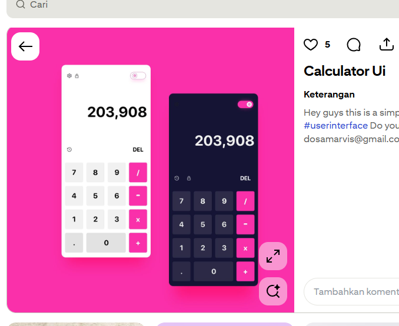
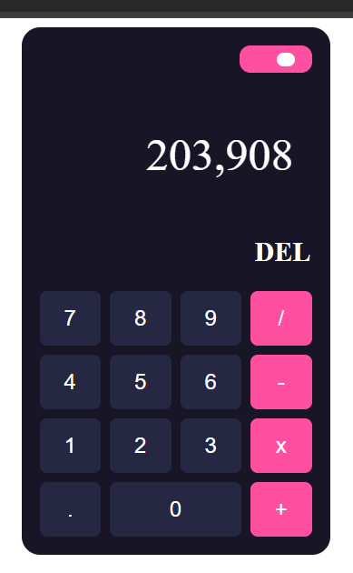

# Calculator UI

## preview
contoh:

hasil :

Cara Kerja:

## Deskripsi

Calculator UI adalah aplikasi kalkulator sederhana yang dibuat menggunakan HTML, CSS, JavaScript, dan jQuery. Layout tombol disusun menggunakan CSS Grid dan mendukung operasi matematika dasar seperti penjumlahan, pengurangan, perkalian, dan pembagian.

## Fitur

* Tampilan kalkulator modern
* Layout menggunakan CSS Grid
* Efek hover pada tombol
* Tombol operator dengan warna berbeda

## Teknologi

- HTML5
- CSS3
- JavaScript
- jQuery

## Fungsionalitas

- Melakukan operasi penjumlahan (+)
- Melakukan operasi pengurangan (-)
- Melakukan operasi perkalian (×)
- Melakukan operasi pembagian (/)
- Menghapus input terakhir (DEL)
- Menampilkan hasil perhitungan secara langsung

